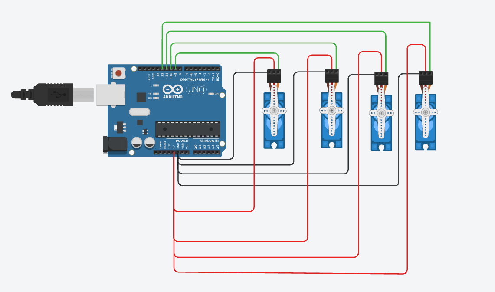

# 🤖 4-Servo Motor Control — Arduino Uno Tinkercad

# 🌟 Task Instructions:

Program 4 servo motors to perform the following actions in the code :

1. Run using the Sweep example for 2 seconds.

2. After that, make all the motors hold at 90 degrees.

# ✨ The solution:

## 🔧 Hardware
| Component     | Quantity |
|----------------|----------|
| Arduino Uno R3 | 1        |
| Servo motor    | 4        |

## 🔌 Wiring

| Servo | Signal (green) | Power (red) | Ground (black) |
|-------|------------------|-------------|-----------------|
| 1     | Pin 9            | 5V          | GND             |
| 2     | Pin 10           | 5V          | GND             |
| 3     | Pin 11           | 5V          | GND             |
| 4     | Pin 12           | 5V          | GND             |

All 4 servos share the Arduino's **5V** and **GND** pins; each has its own dedicated signal pin.

## 💻 Code
```cpp
#include <Servo.h>

Servo servo1;
Servo servo2;
Servo servo3;
Servo servo4;

void setup() {
  servo1.attach(9);
  servo2.attach(10);
  servo3.attach(11);
  servo4.attach(12);

  unsigned long startTime = millis();

  // Run for 2 seconds
  while (millis() - startTime < 2000) {
    for (int pos = 0; pos <= 180; pos += 1) {
      servo1.write(pos);
      servo2.write(pos);
      servo3.write(pos);
      servo4.write(pos);
      delay(15);
    }
    for (int pos = 180; pos >= 0; pos -= 1) {
      servo1.write(pos);
      servo2.write(pos);
      servo3.write(pos);
      servo4.write(pos);
      delay(15);
    }
  }

  // After sweeping, hold all motors at 90 degrees
  servo1.write(90);
  servo2.write(90);
  servo3.write(90);
  servo4.write(90);
}

void loop() {
  // motors stay at 90°
}
```

## 🖼️ Circuit


## 🎬 Demo
A short simulation video demonstrating the sweep-then-hold behavior is included: [`demo.mp4`](demo.mp4)

## ▶️ How to Run Tinkercad
1. Open [Tinkercad Circuits](https://www.tinkercad.com/) → **Create** → **Circuits**.
2. Add an **Arduino Uno R3** and **4 servo motors**.
3. Wire each servo according to the table above.
4. Open the **Code** editor, switch to **Text** mode, and paste the code above.
5. Click **Start Simulation**.
